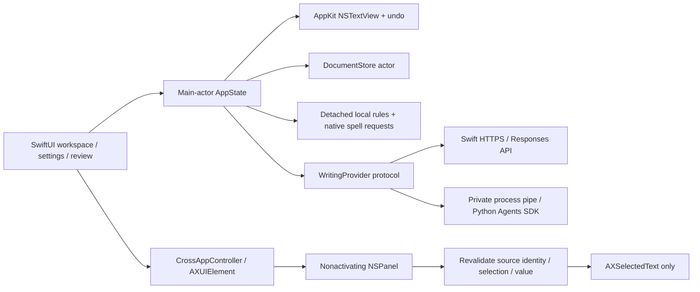

# Architecture and decisions

Clearline is a native Swift package with two production targets and one XCTest target. All branding constants are in `Sources/ClearlineCore/Models.swift`; the packaging script derives the bundle identity/version from those values. The app uses a deliberately small set of boundaries, not a plugin framework.

## Text integrity

`WritingDocument` owns a UUID, text, monotonic revision, format, optional RTF data, and modified timestamp. `Suggestion` owns a UUID, source revision, category, rule/provider identifier, original/replacement, explanation, UTF-16 range, and a flag distinguishing optional advice from a correction. Dictionary and terminology choices are user data, not bundled AI results.

All integration boundaries use `UTF16Range`. `EditEngine` rejects negative/overflowing ranges, surrogate splits, boundaries inside composed characters, mismatching originals, stale revisions, overlaps, and meaning-changing batch edits. Validation happens before mutation. Batch edits apply from right to left. AppKit preflights all changes together and registers them as one undo group. `ClearlineTextView` has its own undo manager; explicit Edit menu commands avoid SwiftUI's disabled default command routing. Switching documents clears the transient editor undo stack; persisted snapshots provide cross-session restoration.

Current suggestions are invalidated immediately on text edits. Detached local analysis is debounced, cancellable, and discarded if its generation/document/revision is obsolete. Native spelling uses asynchronous `NSSpellChecker` requests in bounded overlapping chunks. Chunk ownership and whitespace boundaries prevent duplicate boundary findings; incomplete tokens at a cut are skipped. Named entities identified by NaturalLanguage, quoted passages, code, URLs, and recognizable identifiers are protected. Name recognition is conservative and incomplete. Local style expressions run on a background task; native UI updates stay on the main actor.

IME marked text suspends analysis and clears highlights until composition commits. Dictation is left to NSTextView; complex live dictation/IME behavior is not yet manually certified. Highlights are temporary layout attributes and do not pollute RTF data. Native editor attributes are saved with RTF documents. Meaning-changing rich-text replacement can flatten formatting inside the changed range and is disclosed in the review panel.

## Storage

`DocumentStore` serializes IO on an actor. A debounced snapshot is encoded to JSON and atomically replaces the primary. The previous valid primary becomes the backup. Recovery preserves a damaged primary before using backup. Unknown future library schemas fail visibly rather than silently downgrading. Additive preferences merge with defaults; changed field types require a future explicit migration. All delete paths purge automatic recovery content. External captures remain in memory. Explicitly appending a proposal uses the normal editor, document save, and revision-history path.

JSON was chosen over SwiftData for transparent backup/recovery and deterministic testing without persistent-store tooling. It is appropriate for an initial local library; whole-library serialization and 50 full snapshots per document are a scaling limitation. Future work should move large libraries to a transactional store without changing document IDs or revision semantics. Time Machine/manual backups are independent of app deletion.

## OpenAI

`WritingProvider` has a single asynchronous operation returning a strict `WritingResult`. Tests inject a URLProtocol transport and fixtures only inside the XCTest target. No fake provider is reachable from production controls.

The Swift provider uses `/v1/responses`, strict `text.format` JSON Schema, `store: false`, and no external tools. Document text and the previous proposal are serialized as untrusted input fields separate from the operation instructions. The API never has a document-editing capability. The model outputs a proposal; the Swift client validates it and the user decides whether to apply it.

Model IDs are discovered directly from `/v1/models` without an allowlist or HTTP cache. The curated capability catalog only supplies known reasoning settings. Unknown IDs remain selectable, labeled unverified for writing, and omit reasoning in both providers. The Models endpoint does not declare endpoint, structured-output, or reasoning compatibility; discovery is not a capability test, and no generation probes run during refresh. A failed refresh clears the available list. The request constructor independently rejects unsupported effort values. An immutable configuration snapshot prevents picker changes from changing an in-flight request. Model switching is never an error fallback.

The streaming parser ignores progress/tool-like events except text-progress counts and the completed response. It requires a completed, non-refused, bounded response and well-formed structured output. Invalid ranges or overlaps reject the entire analysis proposal. Cancellation and failure do not call the edit layer. Transient server/rate-limit retries are bounded at two, with capped backoff. Network errors are presented without echoing provider response bodies.

The optional SDK boundary is a per-operation Python child. It uses official `Agent`, `Runner`, `OpenAIResponsesModel`, typed Pydantic output, no tools, one turn, bounded SDK retries/timeouts, and disabled tracing. A private pipe avoids a localhost credential listener. Credentials are neither command arguments nor child environment variables; stdin carries them in memory. The child has no persistent conversation state. The release installer must install/manage its own supported Python environment; the native provider requires none.

Voice samples are used only when the user chooses Describe voice. Only the editable derived description accompanies subsequent requests, and only when enabled. Follow-up instructions keep the captured original and include the previous proposal explicitly. Fact-change detection is heuristic; it examines quantities, capitalized names/dates, links, and protected material, and asks for review. It cannot guarantee preservation or truth.

## Cross-app isolation

Internal document identity and external source identity are separate types. The external snapshot retains PID, bundle ID, actual AX element, selected text, and optional UTF-16 range and bounds. Only a replaceable capture retains a verified, bounded full field value. A read-only selection can be captured without a range or full field; replacement capability requires a settable selected-text attribute and a matching range in the full field. It excludes secure/password roles and ancestors before fetching contents. It only reads the foreground app in direct response to the shortcut/menu action. There is no background collection or clipboard reading.

Replacing requires current permission, unpaused/enabled status, allowed/not-blocked app, same foreground PID, `CFEqual` on the focused AX element, identical source value, identical selected range, and identical selected text. Only a settable `AXSelectedText` attribute is written. After success the full value is checked against the expected edit; a host that reports success but does something unexpected receives a warning, not a misleading guarantee. No universal atomic undo or formatting behavior is assumed.

Event observations are installed only for an active replaceable capture and removed on invalidation. Read-only captures are immutable snapshots that stay usable after source changes and app switching. The panel offers Copy and an explicit append to the currently displayed workspace document; append revalidates the destination and uses the native editor for formatting preservation, undo, and persistence. Unsupported notifications do not weaken final validation. The panel uses mouse-display bounds as a reliable fallback; it does not claim precise range anchoring. Continuous focused-field checking and inline indicators remain gated on real host validation and are not active in this build.

## Distribution and known tradeoffs

Minimum deployment target is macOS 14, selected for SwiftUI change handlers and stable native frameworks. Only the documented newer Mac/Xcode combination has been exercised; deployment targeting does not prove behavior on macOS 14 or Intel hardware.

Direct Developer ID distribution is planned because Apple's sandbox guidance excludes assistive AX API usage. Current builds are ad-hoc signed local development apps. No private AX API, DOM injection, browser extension, generic backend, cloud document store, analytics SDK, or shared API secret is included.

Remaining engineering work is tracked in FEATURES.md and COMPATIBILITY.md, including actual provider/host certification, continuous cross-app behavior, advanced format fidelity, larger-library scaling, comprehensive IME/dictation/VoiceOver checks, and release signing/notarization.

### Local API usage

`UsageStore` serializes token aggregation and atomically writes `api-usage.json` separately from documents. Native terminal-response metadata is recorded before proposal parsing, so a malformed or incomplete proposal can still contribute reported usage. The SDK worker returns per-response usage alongside its structured result; generated proposal fields cannot set token counts. All writing paths share the metered providers from `AppState.makeProvider()`.

Settings shows UTC day/month/all-recorded totals and per-model counts. Cached tokens are a subset of input; reasoning tokens are a subset of output. Missing metadata is omitted rather than inferred as zero. Interrupted streams and SDK failures can undercount; the view labels these as local usage, links to account billing, and offers a reset. Corrupt or newer-schema usage files are preserved until explicit reset. Usage storage failures are shown in Settings and do not invalidate writing proposals.

Read-only capture uses public [selected-text](https://developer.apple.com/documentation/applicationservices/kaxselectedtextattribute) and [string-for-range](https://developer.apple.com/documentation/applicationservices/kaxstringforrangeparameterizedattribute) attributes. Support depends on what each host exposes.

### Markdown tables

`MarkdownTable` parses top-level GFM source into headers, rows, alignments, and UTF-16 block ranges. Escaped pipes remain inline Markdown; the explicit spreadsheet importer escapes literal text and handles TSV quoting. It rejects embedded newlines and excessive dimensions. Rows exceeding header width are flagged so the grid cannot silently drop their extra cells.

`MarkdownTableSession` holds a temporary grid plus the original document ID, revision, range, and text. Apply revalidates these through `EditorBridge`, replaces only the captured range in a named undo group, and uses the normal text-change/autosave path. Cancel does not mutate source. The toolbar and Table menu share this path. Undo routes to the active sheet field while the grid is open.

Preview uses Foundation presentation intents with native `NSTextTable`/`NSTextTableBlock` layout. Empty top-level cells receive a zero-width placeholder only in rendering input because Foundation omits empty runs. The original source remains unchanged. The scroll view enforces a minimum table width while reflowing at workspace zoom. Local checks protect delimiters/padding while continuing to inspect cell prose; shared provider instructions request preservation of table structure.
